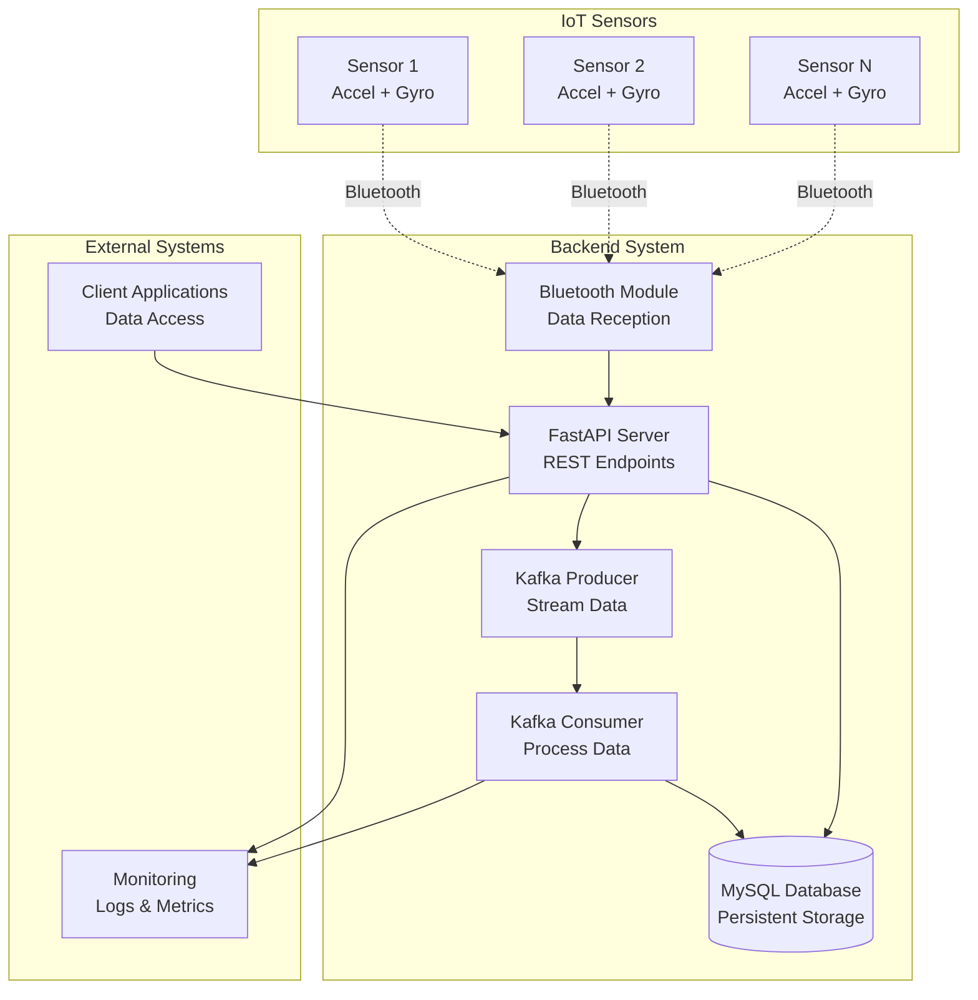

# Sensor Data Collection Backend Architecture

## Overview
A FastAPI-based backend system for collecting acceleration and gyroscope data from IoT sensors via Bluetooth, using Kafka for real-time data streaming and MySQL for persistent storage.

## System Architecture



## Data Flow

1. **Data Collection**: IoT sensors transmit acceleration and gyroscope data via Bluetooth
2. **Reception**: Bluetooth module receives and parses sensor data
3. **API Processing**: FastAPI server validates and processes incoming data
4. **Streaming**: Kafka producer streams data for real-time processing
5. **Storage**: Kafka consumer processes and stores data in MySQL
6. **Access**: REST API provides data access for client applications

## Database Schema

### Sensors Table
```sql
CREATE TABLE sensors (
    id VARCHAR(50) PRIMARY KEY,
    name VARCHAR(100) NOT NULL,
    device_type VARCHAR(50) NOT NULL,
    mac_address VARCHAR(17) UNIQUE NOT NULL,
    status ENUM('active', 'inactive', 'error') DEFAULT 'active',
    created_at TIMESTAMP DEFAULT CURRENT_TIMESTAMP,
    updated_at TIMESTAMP DEFAULT CURRENT_TIMESTAMP ON UPDATE CURRENT_TIMESTAMP
);
```

### Sensor Data Table
```sql
CREATE TABLE sensor_data (
    id BIGINT AUTO_INCREMENT PRIMARY KEY,
    sensor_id VARCHAR(50) NOT NULL,
    timestamp TIMESTAMP(3) NOT NULL,
    acceleration_x DECIMAL(10,6) NOT NULL,
    acceleration_y DECIMAL(10,6) NOT NULL,
    acceleration_z DECIMAL(10,6) NOT NULL,
    gyroscope_x DECIMAL(10,6) NOT NULL,
    gyroscope_y DECIMAL(10,6) NOT NULL,
    gyroscope_z DECIMAL(10,6) NOT NULL,
    battery_level TINYINT UNSIGNED,
    signal_strength TINYINT,
    created_at TIMESTAMP DEFAULT CURRENT_TIMESTAMP,
    
    FOREIGN KEY (sensor_id) REFERENCES sensors(id),
    INDEX idx_sensor_timestamp (sensor_id, timestamp),
    INDEX idx_timestamp (timestamp)
);
```

## API Endpoints

### Sensor Management
- `GET /sensors` - List all sensors
- `POST /sensors` - Register new sensor
- `GET /sensors/{sensor_id}` - Get sensor details
- `PUT /sensors/{sensor_id}` - Update sensor configuration
- `DELETE /sensors/{sensor_id}` - Remove sensor

### Data Collection
- `POST /data/ingest` - Receive sensor data (internal)
- `GET /data/{sensor_id}` - Get sensor data with filters
- `GET /data/latest/{sensor_id}` - Get latest readings
- `GET /data/stream/{sensor_id}` - WebSocket for real-time data

### System Health
- `GET /health` - System health check
- `GET /metrics` - System metrics
- `GET /status` - Service status

## Technology Stack

- **Backend Framework**: FastAPI (Python)
- **Database**: MySQL 8.0+
- **Message Queue**: Apache Kafka
- **Bluetooth**: PyBluez / Bleak library
- **Data Validation**: Pydantic
- **Database ORM**: SQLAlchemy
- **Configuration**: Pydantic Settings
- **Logging**: Python logging + structured logs
- **Monitoring**: Prometheus metrics (optional)

## Configuration Structure

```python
class Settings:
    # Database
    DATABASE_URL: str
    
    # Kafka
    KAFKA_BOOTSTRAP_SERVERS: str
    KAFKA_TOPIC_SENSOR_DATA: str
    
    # Bluetooth
    BLUETOOTH_SCAN_TIMEOUT: int = 10
    BLUETOOTH_RECONNECT_ATTEMPTS: int = 3
    
    # API
    API_HOST: str = "0.0.0.0"
    API_PORT: int = 8000
    
    # Logging
    LOG_LEVEL: str = "INFO"
```

## Data Models

### Sensor Data Model
```python
class SensorReading(BaseModel):
    sensor_id: str
    timestamp: datetime
    acceleration: AccelerationData
    gyroscope: GyroscopeData
    battery_level: Optional[int] = None
    signal_strength: Optional[int] = None

class AccelerationData(BaseModel):
    x: float
    y: float
    z: float

class GyroscopeData(BaseModel):
    x: float
    y: float
    z: float
```

## Deployment Considerations

- **Environment Variables**: Use `.env` files for configuration
- **Docker**: Containerize the application for easy deployment
- **Database Migrations**: Use Alembic for schema management
- **Monitoring**: Implement health checks and metrics collection
- **Error Handling**: Comprehensive error handling and logging
- **Security**: API authentication and data validation